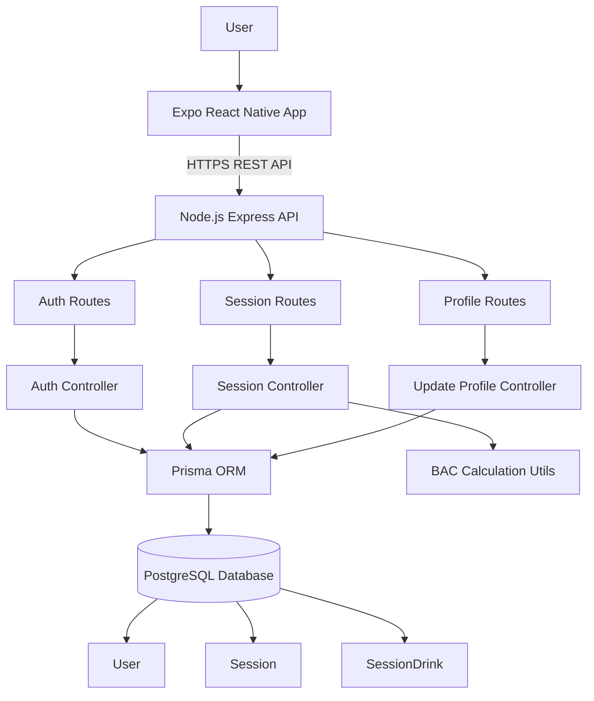
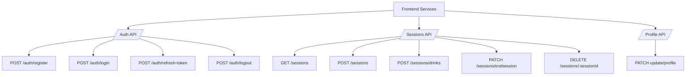
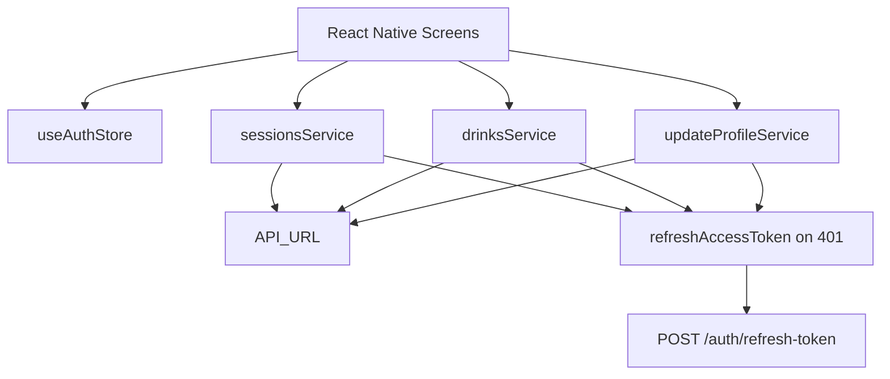
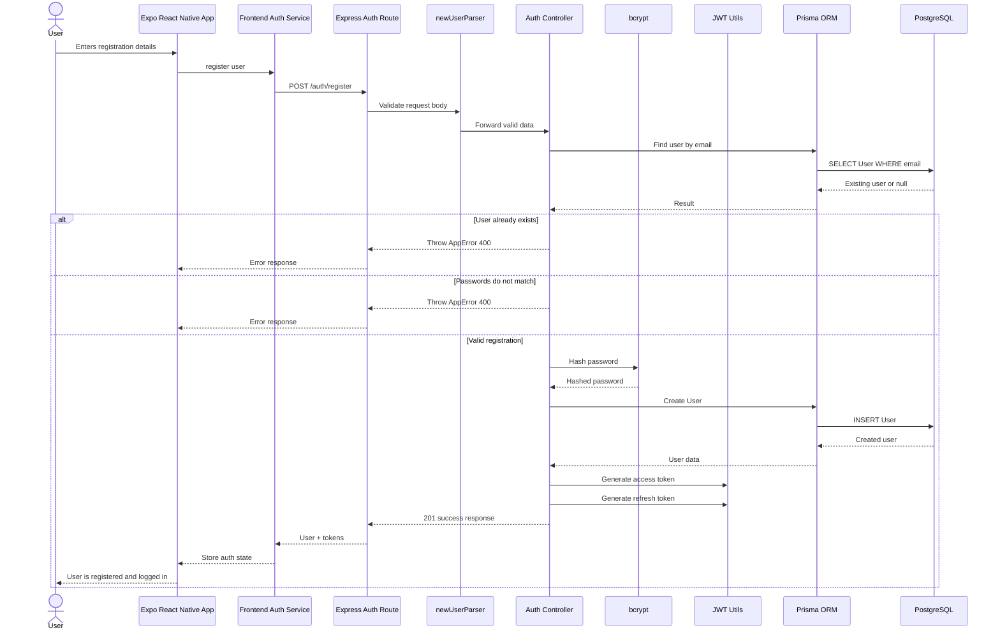
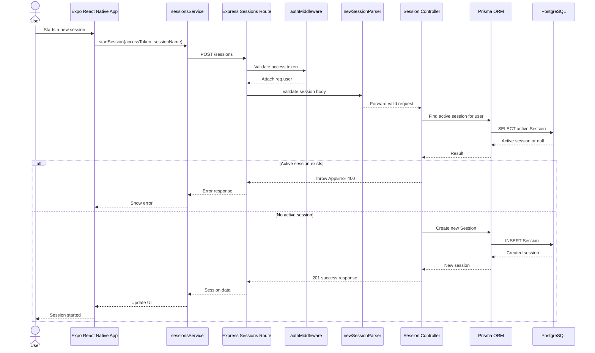
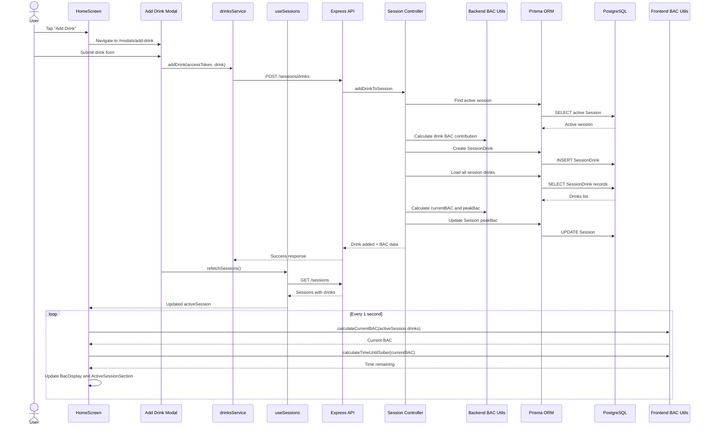
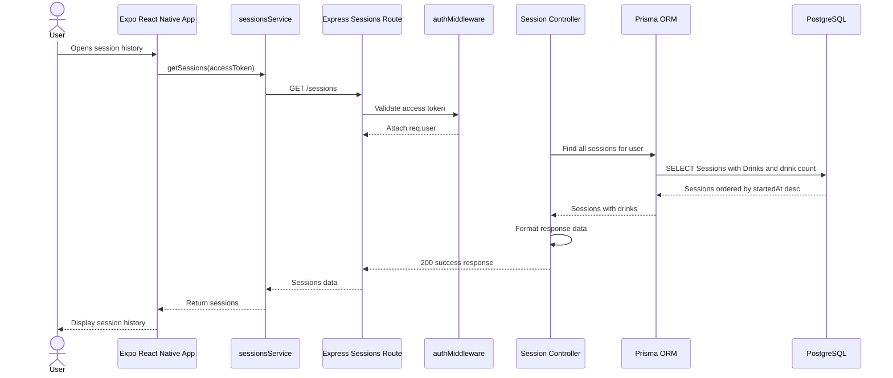
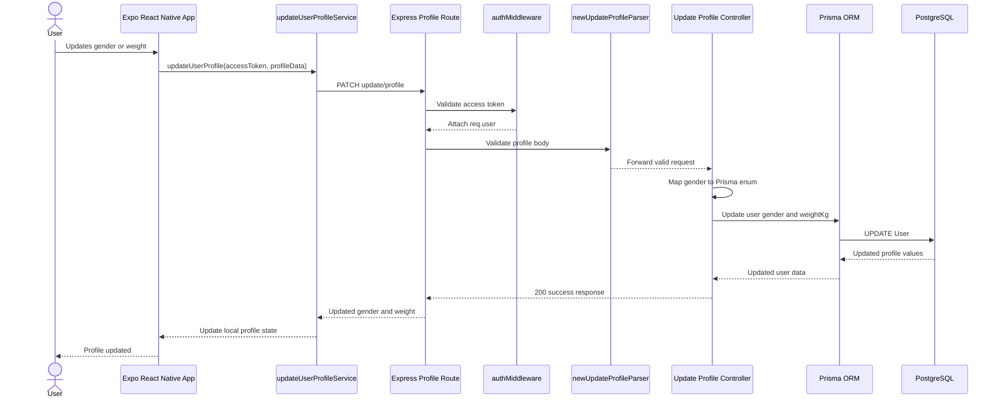

# ZeroPromile App Architecture

ZeroPromile consists of a mobile frontend built with **Expo React Native**, a **Node.js Express REST API** backend, **Prisma ORM**, and a **PostgreSQL** database

---

## High-level Architecture



---

## Backend Route Overview



---

## Frontend Service Layer

The frontend communicates with the backend through service modules.



All authenticated frontend requests include:

```http
Authorization: Bearer <accessToken>
```

If the backend returns `401`, the frontend tries to refresh the access token and retries the original request.

---

# Main Application Flows

## Register Flow



---

## Start Session Flow



---

## Add Drink and Live BAC Update Flow

When the user adds a drink, the backend stores the drink and calculates the drink’s BAC contribution. After the frontend refetches sessions, the home screen calculates and updates the user’s current BAC locally every second.



---

## Important Note

The backend calculates and stores:

- drink BAC contribution
- session `peakBac`
- drink history

The frontend calculates live display values:

- current BAC
- time until sober
- sober-at time
- automatic session ending when BAC reaches `0`

---

## Get Sessions Flow



---

## Update Profile Flow



---

# Key Design Decisions

## Token-based authentication

The backend uses access tokens for protected routes. Refresh tokens are used to request a new access token when the old one expires.

## Client-side logout

Logout is handled mainly on the client by deleting stored tokens. The backend logout endpoint returns a success response but does not invalidate tokens server-side.

## One active session per user

Before starting a session, the backend checks whether the user already has an active session. This prevents multiple active drinking sessions for the same user.

## Session deletion rules

Only inactive sessions can be deleted. Active sessions must be ended first.

---
