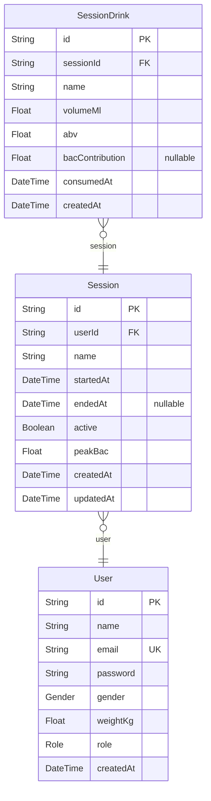

# ZeroPromile database schema

> Generated by [`prisma-markdown`](https://github.com/samchon/prisma-markdown)

- [ZeroPromile](#zeropromile)

## ZeroPromile

### `User`

Represents an application user account.

Properties as follows:

- `id`: Unique identifier for the user (UUID).
- `name`: User’s display name.
- `email`: User’s email address. Must be unique.
- `password`: Hashed password used for authentication.
- `gender`: User’s gender, used for BAC calculations.
- `weightKg`: User’s body weight in kilograms.
- `role`: User role determining access level.
- `createdAt`: Timestamp when the user was created.

### `Session`

Represents a drinking session belonging to a user.

Properties as follows:

- `id`: Unique identifier for the session (UUID).
- `userId`: ID of the user who owns this session.
- `name`: Name or label for the session.
- `startedAt`: Timestamp when the session started.
- `endedAt`: Timestamp when the session ended (if finished).
- `active`: Indicates whether the session is currently active.
- `peakBac`: Highest estimated BAC reached during the session.
- `createdAt`: Timestamp when the session was created.
- `updatedAt`: Timestamp automatically updated when the session changes.

### `SessionDrink`

Represents a single drink consumed during a session.

Properties as follows:

- `id`: Unique identifier for the drink entry (UUID).
- `sessionId`: ID of the session this drink belongs to.
- `name`: Name of the drink (e.g., beer, wine).
- `volumeMl`: Volume of the drink in milliliters.
- `abv`: Alcohol by volume percentage.
- `bacContribution`: Optional BAC contribution from this drink.
- `consumedAt`: Timestamp when the drink was consumed.
- `createdAt`: Timestamp when the drink record was created.
