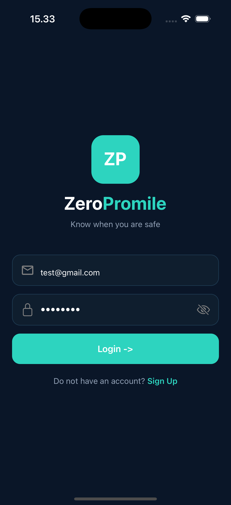

# ZeroPromile User Manual

## Register

  

Create your account to start tracking your sessions and monitoring your BAC.

### What you need to fill in

- **Full Name**  
  Your name as you’d like it to appear in the app.

- **Email Address**  
  Used for logging in.

- **Password**  
  Must be at least 8 characters long.

- **Confirm Password**  
  Re-enter your password to make sure it matches.

- **Gender**  
  Select _Male_ or _Female_. This helps improve BAC estimation accuracy.

- **Weight (Kg)**  
  Your body weight is used to calculate more accurate BAC values.

---

## Login

  

Log in to access your account and continue tracking your sessions.

### What you need to fill in

- **Email Address**  
  The email you used during registration.

- **Password**  
  Your account password (minimum 8 characters).
