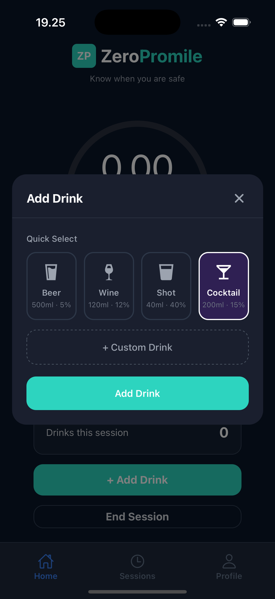
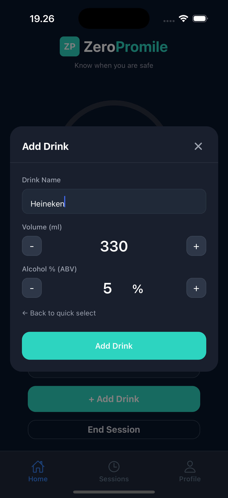

# Add Drink

Track your drinks during a session using either **Quick Select** or a **Custom Drink**.

---

## Quick Select

  

Quick Select allows you to instantly log common drink types without manual input.

### Available options

- **Beer** (500ml • 5%)
- **Wine** (120ml • 12%)
- **Shot** (40ml • 40%)
- **Cocktail** (200ml • 15%)

Simply tap one of the options and then press **Add Drink** to log it to your session.

---

## Custom Drink

  

Use Custom Drink when your drink doesn’t match the predefined options.

### What you can customize

- **Drink Name**  
  Enter the name of your drink (e.g., _Heineken_, _Gin & Tonic_).

- **Volume (ml)**  
  Adjust the size of your drink using the **+ / −** buttons or tap on the middle to write the amount manually.

- **Alcohol % (ABV)**  
  Set the alcohol percentage of your drink.

---

### Switching between modes

- Tap **+ Custom Drink** to switch from Quick Select to Custom mode
- Tap **Back to quick select** to return

---

### Adding your drink

Once your drink details are set, tap **Add Drink** to include it in your current session.

---

### Tips

- Use **Quick Select** for speed when drinking common beverages
- Use **Custom Drink** for better accuracy with unique or mixed drinks
- Accurate volume and ABV values will improve your BAC estimation
