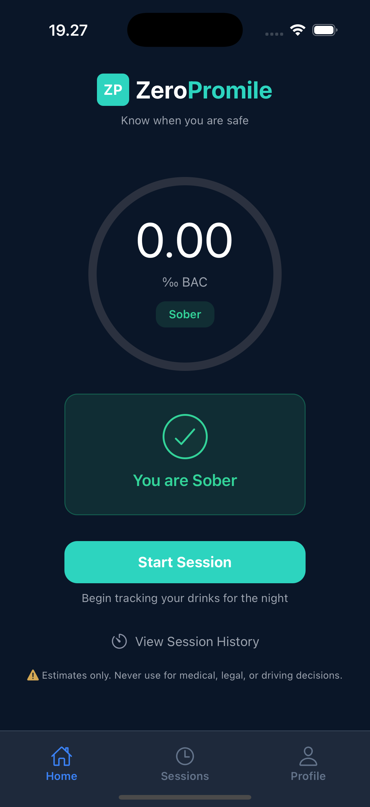

# ZeroPromile User Manual

## Home Screen (Initial View)

  

The home screen is the main dashboard of the app. It gives you a quick overview of your current alcohol level and lets you start tracking a new session.

### What you see on this screen

- **Current BAC (Blood Alcohol Content)**  
  Displayed in the center of the screen.  
  When you haven’t logged any drinks, it will show `0.00 ‰` and your status will be **Sober**.

- **Status Indicator**  
  A simple label (_Sober_) that reflects your current condition based on your BAC level.

- **Start Session Button**  
  Tap **Start Session** to begin tracking your drinks for the current session.

- **Session History Shortcut**  
  Use _View Session History_ to access your past sessions and review your drinking data.

- **Navigation Bar (Bottom)**
  - **Home** → Current screen
  - **Sessions** → View all sessions
  - **Profile** → Manage your account details

### ⚠️ Important Note

The BAC values shown are **estimates only**.  
They should not be used for medical, legal, or driving decisions.

---
