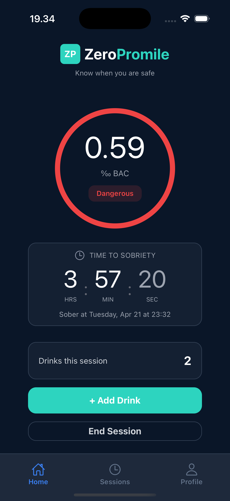

# Session Overview & Time to Sobriety

  

This screen shows your **current BAC level**, session progress, and an estimate of how long it will take for your body to return to sobriety.

---

## Current BAC

- Displayed in the center of the screen
- Measured in **‰ (promille)**
- Updates automatically as you log drinks over time

### Status Indicator

Based on your BAC level, the app provides a clear status such as:

- **Sober**
- **Caution**
- **Dangerous**

In this example, the status is **Dangerous**, indicating a high BAC level (over 0.5).

---

## Time to Sobriety

This section estimates how long it will take for your BAC to return to **0.00‰**.

### What is shown

- **Hours, Minutes, Seconds** remaining
- A projected time when you will be sober again  
  _(e.g., “Sober at Tuesday, Apr 21 at 23:32”)_

---

## Session Summary

- **Drinks this session**  
  Displays the total number of drinks you have logged

---

## Actions

- **Add Drink**  
  Continue logging drinks during your session

- **End Session**  
  Finish the current session when you are done

- **Automatic Session Ending**
  Session ends automatically when your body reaches estimated BAC of **0.00‰**

---

## ⚠️ Important Note

The BAC values and time-to-sobriety estimates are **approximations only**.  
They should **not** be used for medical, legal, or driving decisions.

---

## Tips

- Log drinks as accurately as possible for better estimates
- Even if the timer reaches zero, always make responsible decisions
