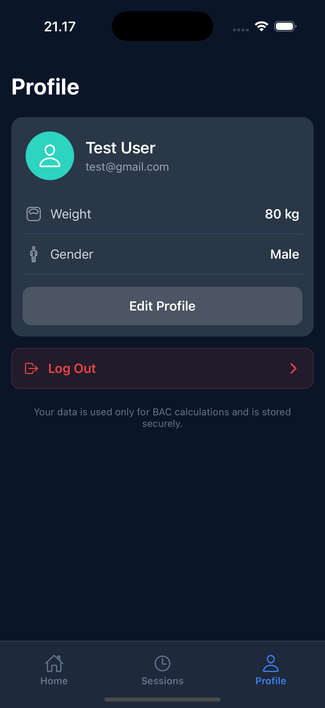
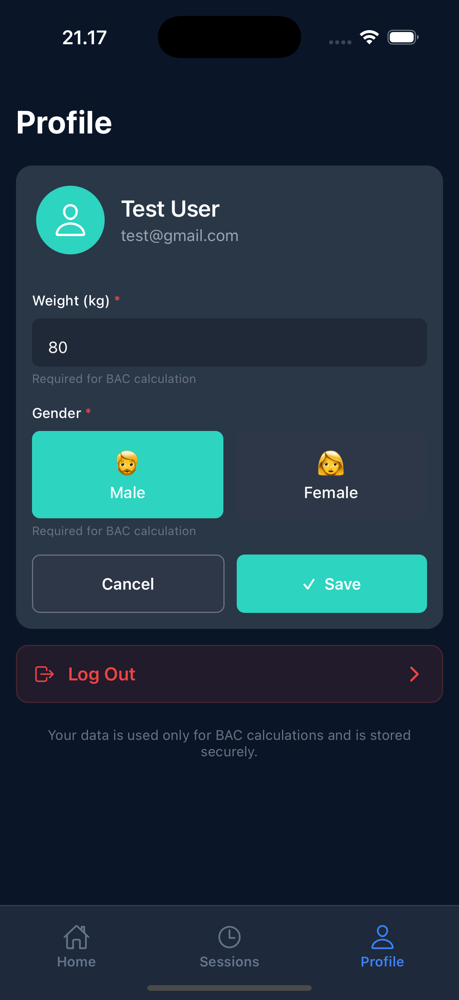

# Profile

  
  

The Profile screen allows you to view and manage your personal information used for BAC calculations.

---

## Profile Overview

This section displays your account details:

- **Name**  
  Your registered full name

- **Email Address**  
  The email linked to your account

- **Weight**  
  Used to calculate your BAC accurately

- **Gender**  
  Also used to improve BAC estimation

---

## Edit Profile

Tap **Edit Profile** to update your information.

### What you can edit

- **Weight (kg)**  
  Enter your current body weight  
  _(Required for accurate BAC calculation)_

- **Gender**  
  Select:
  - **Male**
  - **Female**

---

### Actions

- **Save**  
  Apply and store your updated information

- **Cancel**  
  Discard changes and return to the profile view

---

## Log Out

- Tap **Log Out** to sign out of your account
- You will be returned to the login screen

---

## Data & Privacy

Your data is:

- Used only for **BAC calculations**
- Stored securely within the application

---

## Tips

- Keep your **weight updated** for more accurate results
- Ensure your **gender selection** is correct, as it affects BAC estimation
- Regularly review your profile to maintain accurate tracking
