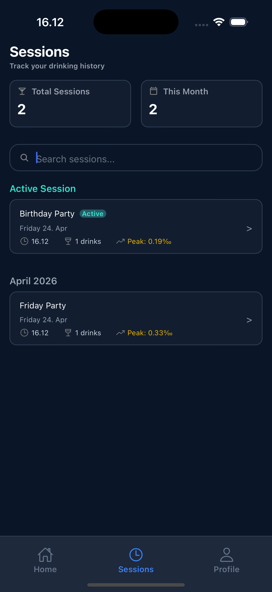

# Session History

  

The Session History screen allows you to review your past and current drinking sessions, along with key statistics.

---

## Overview

At the top of the screen, you’ll find a quick summary:

- **Total Sessions**  
  The total number of sessions you have recorded

- **This Month**  
  The number of sessions created during the current month

- You can **search** for certain sessions from the box below the summary data

---

## Active Session

If you currently have an ongoing session, it will appear here.

### What is shown

- **Session Name**  
  (e.g., _Test Session_)

- **Status Badge**  
  Indicates that the session is **Active**

- **Date**  
  When the session started

- **Start Time**  
  The time the session began

- **Number of Drinks**  
  Total drinks logged so far

- **Peak BAC**  
  The highest recorded BAC during the session

Tap the session to open it and continue tracking.

---

## Past Sessions

Previous sessions are grouped by month (e.g., _April 2026_).

### Each session includes

- **Session Name**  
  (e.g., _Friday Nightout_)

- **Date**  
  When the session took place

- **Start Time**

- **Number of Drinks**

- **Peak BAC**

Tap any session to view more details about it.

---

## Navigation

Use the bottom navigation bar to switch between:

- **Home** → Current session and BAC overview
- **Sessions** → This screen
- **Profile** → Your account details

---

## Tips

- Review past sessions to better understand your habits
- Pay attention to **Peak BAC** to identify high-risk sessions
- Use session names to keep your history organized and meaningful
