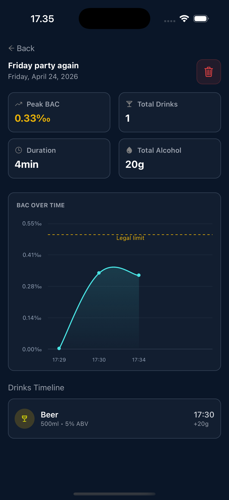

# Session Details & Statistics

  

This screen provides a detailed overview of a specific session, including key statistics, BAC progression, and a timeline of your drinks.

---

## Session Header

- **Session Name**  
  (e.g., _Test Session_)

- **Status Badge**  
  Indicates whether the session is currently **Active** if not nothing is shown

- **Date**  
  The day the session took place

- **Past sessions (no active)** can be **deleted** from the right side by pressing the trash bin icon

---

## Key Statistics

At the top, you’ll find important metrics summarizing your session:

- **Peak BAC**  
  The highest blood alcohol level reached during the session

- **Total Drinks**  
  The number of drinks logged

- **Duration**  
  How long the session has lasted

- **Total Alcohol**  
  The total amount of alcohol consumed (in grams)

---

## BAC Over Time

This chart visualizes how your BAC changes throughout the session.

### What it shows

- BAC values plotted over time
- Each point represents a logged drink or time update
- A highlighted peak where your BAC was highest

You can tap or hover on points to see detailed information such as:

- Drink name, volume (ml) and ABV
- Time consumed
- BAC at that moment

---

## Drinks Timeline

A chronological list of all drinks in the session.

### Each entry includes

- **Drink Name**  
  (e.g., _Beer_, _Shot_)

- **Volume & ABV**  
  (e.g., _500ml • 5% ABV_)

- **Time Consumed**

- **Alcohol Contribution**  
  Amount added to your total alcohol intake (e.g., `+13g`)

---

## Navigation

Use the back button to return to your session list or previous screen.

---

## ⚠️ Important Note

All BAC values and calculations are **estimates only**.  
They should not be used for medical, legal, or driving decisions.

---

## Tips

- Review your BAC chart to understand how different drinks affect you over time
- Use the timeline to track exactly what and when you drank
- Monitoring **peak BAC** can help you make safer decisions in future sessions
